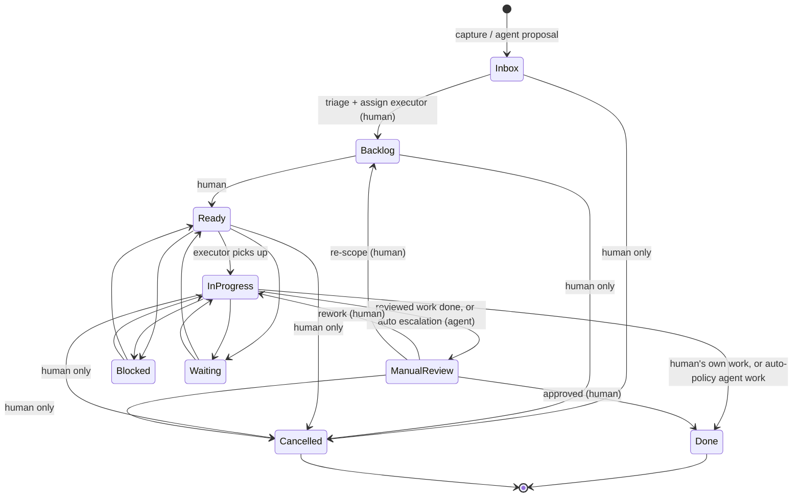

# State Machine

Status: working draft. The board is a shared task manager for one human and their agent(s): the human plans and works their own cards, hands selected cards off to an agent, and reviews delegated work before it is final — except trusted automations they have explicitly exempted. This doc formalizes the states, the transitions, and — the point of the exercise — who is allowed to trigger each transition. The rules are keyed off two authenticated facts: the **actor type** of the caller and the **executor** of the card. This is the contract the API must enforce.

## Actors

| Actor | Definition |
|---|---|
| **Human** | Any client authenticated as a human user. |
| **Agent** | Any client authenticated as an automated agent (LLM-driven or scripted). |
| **System** | The board itself, acting without a request from either party (e.g. a timer elapsing). Included for completeness; may not exist in v1. |

An actor is identified by its auth credential, not by claimed identity in a request body — the API must derive actor type from the authenticated session, never trust a client-supplied "acting as human" flag.

## Executor: who is doing this card

Every card has an **executor**: `human`, `agent`, or `unassigned`. This is a first-class field, not a label, because most transition rules depend on it.

- **The human assigns executors.** Handing a card off ("offloading") means setting its executor to an agent; taking it back means setting it to human. **Executor changes are human-only** — an agent must never be able to assign work to itself or shed work it was given. An agent may *volunteer* for a card via an annotation ("I could take this"), but the assignment itself is the human's act.
- **Agents may only transition cards they execute.** On every other card an agent is read-and-annotate only: it can post progress notes, suggestions, and proposed breakdowns anywhere, but it cannot move someone else's card.
- **Human-executed cards have no review gate.** The human moves their own cards freely, including straight to Done — you don't review your own work.
- **Agent-executed cards gate by default.** A completed delegated card lands in `Manual Review` with a progress summary and suggested next steps, and the human closes it out. This replaces the earlier lane-1/lane-2 distinction: all delegated work is treated as unattended, and interactive work-with-an-agent happens on *human*-executed cards, where the human owns the transitions anyway. The one exception is the `auto` review policy, below.

## Review policy: reviewed vs. auto

Some delegated work is trusted, repeatable automation where per-run review is pure friction. Rather than running it outside the system — where it would be invisible: no audit trail, no failure surfacing, no inventory of what has been automated — each agent-executed card carries a **review policy**:

- **`reviewed`** (default): the card gates through `Manual Review` as above.
- **`auto`**: the agent may close the card `In Progress → Done` directly, still with a required completion summary.

Three rules keep `auto` from hollowing out the gate:

1. **Only a human sets or changes review policy**, exactly like executor. Marking a task `auto` *is* the review, amortized: the human approves the task definition once instead of every run.
2. **An agent may always escalate.** Routing an `auto` card into `Manual Review` anyway — something unexpected, ambiguous, or beyond what was approved — is always allowed, because asking for review only tightens supervision. The reverse never is.
3. **Auto runs stay on the board.** Every run is a card with a full audit trail, failures land in `Blocked` where the attention view already looks, and completed auto work is filterable for spot-checks.

## States

| State | Meaning | Terminal? |
|---|---|---|
| **Inbox** | Newly captured, unsorted. No executor yet. | No |
| **Backlog** | Triaged; accepted into the pipeline, executor assigned, not yet actionable. | No |
| **Ready** | Actionable; queued for its executor to pick up. | No |
| **In Progress** | Actively being worked by its executor. | No |
| **Manual Review** | Delegated work is finished; awaiting human review. Agent-executed cards only. | No |
| **Done** | Complete (and, for delegated work, approved). | Yes |
| **Blocked** | Stalled; something must change before work can continue. | No |
| **Waiting** | Paused pending a time or event; expected to resume on its own. | No |
| **Cancelled** | Withdrawn from the pipeline without completing. | Yes |

`Blocked` vs `Waiting` remains a proposal (see Open Questions): `Blocked` means intervention is needed — and a blocked agent card is a signal for the human's attention; `Waiting` means the card will resume by itself.

## Transitions

| From | To | Meaning | Allowed actor(s) | Reversible? |
|---|---|---|---|---|
| *(none)* | Inbox | Card created (human capture, or agent-proposed work/subtasks) | Agent, Human | — |
| Inbox | Backlog | Triaged: accepted and executor assigned | **Human only** | Yes |
| Backlog | Ready | Marked actionable | **Human only** | Yes |
| Ready | In Progress | Executor picks the card up | **Executor only** (agent for its cards, human for theirs) | Yes |
| In Progress | Manual Review | Delegated `reviewed` work finished (summary + next steps attached) — or an `auto` card escalating | **Agent (executor), agent-executed cards only** | Yes (human may send back) |
| In Progress | Done | Own work finished, or trusted automation completed (summary required) | **Human (human-executed cards), Agent (executor, `auto` cards only)** | No |
| Manual Review | Done | Reviewed and approved | **Human only** | No |
| Manual Review | In Progress | Sent back for rework (with a reason) | **Human only** | Yes |
| Manual Review | Backlog | Sent back for re-scoping | **Human only** | Yes |
| Ready / In Progress | Blocked | Blocker flagged (with a note saying what's needed) | Executor, Human | Yes |
| Blocked | *(state it was blocked from)* | Blocker resolved | Executor, Human | Yes |
| Ready / In Progress | Waiting | Paused for a time or event | Executor, Human, System | Yes |
| Waiting | *(state it was waiting from)* | Time/event elapsed | Executor, Human, System | Yes |
| Any non-terminal state | Cancelled | Withdrawn | **Human only** | **No** |

Design notes:

- **Triage (`Inbox → Backlog`) and scheduling (`Backlog → Ready`) are human-only** in this draft. The pre-execution pipeline is the human's planning space — it is where the "spend more time or offload?" decision happens, so an agent doesn't get to make it. Agents participate by *proposing*: creating cards in Inbox and annotating existing ones. Flagged in Open Questions in case this proves too much friction.
- **A request that violates these rules must fail closed (403)** — e.g. an agent trying to transition a card it doesn't execute, or trying to touch `Done` — never be silently coerced into an allowed transition.

## Progress notes and suggested next steps

Keeping the human and agent "on the same page" is mostly not state transitions — it's annotations. Two rules make them reliable:

1. **Any actor may annotate any card, any time.** Progress notes, questions, suggestions, "I could take this," proposed breakdowns. Annotations never require transition permission.
2. **An agent transition into a human-attention state requires a note.** Entering `Manual Review` requires a summary of what was done plus **suggested next steps**; entering `Blocked` requires what is needed to unblock. This is what makes "check the progress of handed-off tasks" a glance at the board instead of an interrogation.

## Decomposition

Complex cards break into child cards (parent/child link, not a checklist, so each child gets its own state, executor, and audit history).

- The human decomposes their own cards freely.
- **An agent proposes a breakdown by creating child cards in `Inbox`**, linked to the parent. They enter the pipeline only when the human triages them — accepting a proposed breakdown *is* the triage act.
- Children are offloaded independently: a parent the human keeps can have children handed to an agent, and vice versa. This is the core "offload" workflow — break a big card down, keep the parts that need you, hand off the parts that don't.
- A parent is not `Done` until its children are terminal (`Done` or `Cancelled`). Whether the parent auto-advances is open (see Open Questions).

## What needs my attention

The board should be able to answer "what should I look at?" as a single filter, derivable from state + executor:

- `Manual Review` — delegated work awaiting your review.
- `Blocked` where the executor is an agent — the agent needs something from you.
- `Inbox` — untriaged capture, including agent-proposed cards and breakdowns.
- Cards with unread annotations (suggestions, questions).
- Recently completed `auto` cards, as a low-priority digest for spot-checking — visibility without a gate.

The complementary "what should I offload?" question is a human judgment the board supports but doesn't automate: stale human-executed cards, or cards an agent has volunteered for, are the raw material. An agent may flag offload candidates via annotation; it cannot act on them.

## Diagram

## Audit trail

Per design principle 5, every transition is an event, not just a column write. At minimum each event records:

- `card_id`
- `from` / `to` state
- `actor_id` and `actor_type` (agent/human/system)
- `executor` and `review_policy` — the card's ownership regime at the time of the transition, so the audit trail shows what authorized it
- `timestamp`
- `reason` — required on `Manual Review → *` transitions (the approval/rejection note) and agent transitions into `Blocked`; optional elsewhere

**Executor and review-policy changes are themselves audit events** — they alter what an agent is allowed to do — as are annotations. Events are append-only and exportable; the current state of a card is a projection of its event history, not a separately-trusted field.

## Open questions

- Is human-only triage (`Inbox → Backlog`) and scheduling (`Backlog → Ready`) too much friction? Alternative: an agent may triage cards *it created* into Backlog with executor pre-set to itself, subject to a human veto window.
- In an interactive session, the human's intent flows through an agent's credential ("looks good, mark it done" → the agent calls the API). Does "human-only" mean human *credential* or human *intent*? Drafted as credential — even mid-session, closing a gate or changing an executor goes through the human's own token — so "attended" can't become a loophole. Revisit if it proves unusable.
- Does a parent card auto-advance when all children are terminal, or does it just surface as "reviewable"?
- Is the `Blocked` vs `Waiting` split worth the state count, or should these collapse into one paused state with a reason field?
- Recurrence for repeatable delegated tasks: does the System clone a template card into `Inbox`/`Ready` on a schedule? (Cloning keeps `Done` terminal and gives each run its own audit history, so it's the leading candidate. Recurring templates are also the natural place to hang an `auto` grant — approve the template once, every cloned run inherits the policy.)
- What guardrails accompany `auto` beyond the audit trail — a side-effect budget per run, a periodic spot-check digest, auto-demotion back to `reviewed` after N failures or escalations?
- Is there a path back out of `Done` (reopening), or does correcting a done card mean filing a new one? Drafted as a true terminal state.
- Can an agent cancel a card it executes when it determines the task is obsolete, or is `Cancelled` strictly human-only as drafted?
